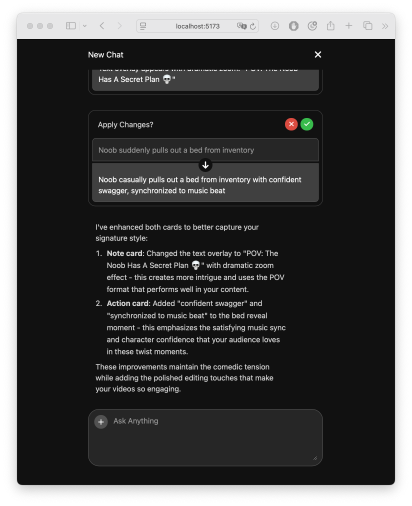

# Palo.ai - Take Home Assignment, Frontend Team

Hello, I am Saharat. Here is my work:

### Frontend

```
cd assignment-frontend
npm install
npm run dev
```

### Backend

```
cd assignment-backend
pip install -r requirements.txt
python app.py
```

URL

`POST http://127.0.0.1:5000/stream`

Body

```
{
	"message": "Hey, can you help me improve my outline?"
}
```

This endpoint accepts POST requests for streaming data.


## Screenshot

**Screenshot showing the initial state of the application upon first load.**


*Figure 1: Initial state of the application.*


*Figure 2: After pressing the request button.*


*Figure 3: Streaming results in progress.*


*Figure 4: Final result after streaming completes.*